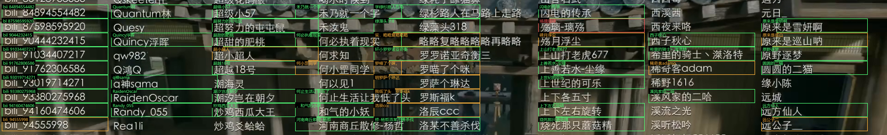
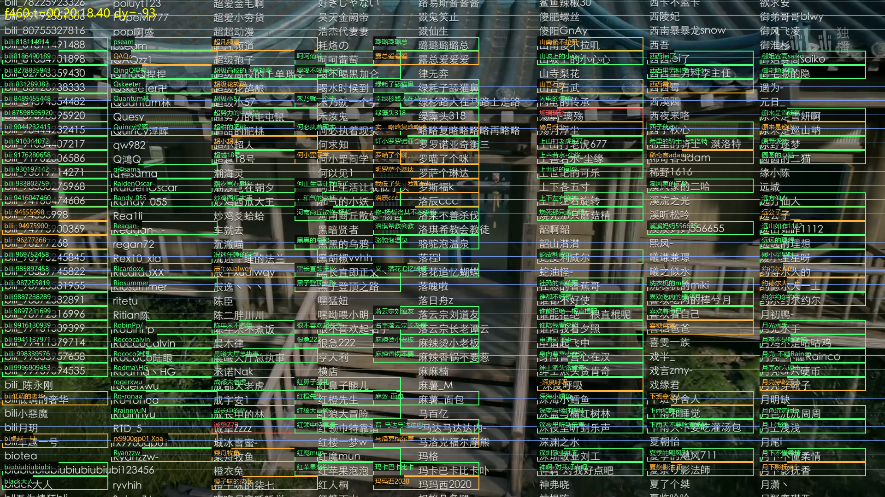

# Fanren Zanzhu Huamingce Tiqu Xitong（凡人修仙传赞助花名册提取系统）

> ⚠️ **本项目只提供名单识别与提取，不提供任何视频下载、解密或破解工具**
>
> 输入为本地视频文件，识别结果仅供学习交流使用，视频版权归原作者所有。

> 实测视频：**慕兰之战17.mp4**（1920×1080 / HEVC / 25fps / 28:30）

从 B 站视频片尾滚动致谢名单中，自动提取全部赞助者用户名、出现时间与档位归属，输出可直接筛选的 CSV 名单。**全本地运行，CPU 即可，零外部服务依赖。**

## 功能特性

- 📜 **滚动名单增量识别**：基于全局行号模型，每个物理行只在首次完整可见时识别一次，零重复识别
- 🎯 **相位链锁定**：以已验证几何为锚点向两侧生长，用重叠行做灰度内容匹配（残差 0~1px），死链自动线性外推兜底
- 🏷️ **档位抬头通道**：大号书法体档位标题自动识别为独立一列（如「落云宗太上长老」），名字按名单顺序挂到对应档位
- 🚫 **尾切保护**：滚完后的结尾画面自动排除，不污染名单
- ⚡ **本地优先**：onnxruntime CPU 推理，无 GPU 依赖、无任何 outbound 请求
- 📊 **直接交付**：4 列 CSV（当前秒 | 当前帧 | 抬头 | 用户名），阅读顺序排列，附带低置信复核清单

## 成果（实测，两部视频）

| 视频 | 名字条目 | 名单结构 | 识别质量 | 输出 |
|---|---|---|---|---|
| 慕兰之战17 | **33,783** | 6 个档位段（含书法体抬头） | ok 53.7% / 低置信 46.3% | `output/` |
| 重返天南18 | **101,004** | 单段长名单（1 个抬头，19 分钟） | ok 61.8% / 低置信 38.2% | `output_重返天南18/` |

覆盖区间：00:19:39 → 00:28:20（第一部的多档位名单）/ 00:19:27 → 00:38:06（第二部的单段长名单）。

## 环境要求

- Python 3.10+
- ffmpeg（需在 PATH 中，用于抽帧）
- Windows 10/11（实测）

## 效果预览

识别标注（原始画面 + 逐格识别文本，绿=高置信 橙/红=待复核）：



全屏网格标注（行号网格 + 增量识别结果）：



## 使用方式（从视频到名单）

以从 `XX.mp4` 提取为例（本仓库实测视频为 慕兰之战17.mp4）：

```bash
# 1) 安装依赖（另需 ffmpeg 已装并在 PATH 中）
pip install -r requirements.txt

# 2) 自测：抽 9 个采样帧跑通全流程（约 3 分钟），先确认环境与视频可用
python src/extract.py smoke --video "D:\videos\XX.mp4"

# 3) 全量提取：145 个采样帧，约 25 分钟（6 进程并行）
python src/extract.py full --video "D:\videos\XX.mp4"

# 4) 取结果（output/ 目录）
#    names.csv           → 名单，Excel 直接打开筛选
#    pending_review.csv  → 低置信复核清单（带 score）
#    tiers.csv           → 档位抬头时间轴
```

命令参数：

| 参数 | 说明 |
|---|---|
| `mode` | `smoke`=9 帧自测 / `full`=全量提取 |
| `--video` | 输入视频路径（不传则用源码顶部 `VID` 常量） |
| `--config` | 视频配置 JSON：整套几何/采样参数（pitch/phase/v/anchor/back/fwd/lefts/colw/tier0），示例见 `configs/` |
| `--out` | 输出目录（默认 `output/`） |
| `--work` | 中间产物目录：采样帧/相位表缓存（默认系统 TEMP，可反复重跑） |

提取出的 `names.csv` 长这样（4 列，阅读顺序）：

| 当前秒 | 当前帧 | 抬头 | 用户名 |
|---|---|---|---|
| 00:19:41.60 | 29540 | 落云宗太上长老 | 雁过也 |
| 00:19:41.60 | 29540 | 落云宗太上长老 | idiotshit |
| 00:19:41.60 | 29540 | 落云宗太上长老 | vege1984 |

> ⚠️ 采样区间与几何参数（行距/速度/列布局/采样步长）**每个视频都不同，必须逐一标定**——实测两部同系列视频速度差 37%（260 vs 357 px/s）、行距不同、列位不同。标定后写成 config JSON 传入 `--config`（示例：`configs/重返天南18.json`）；未传 config 时使用默认参数（对应 慕兰之战17）。

## 目录结构

```
.
├── src/
│   └── extract.py           # 提取脚本（smoke / full 两种模式）
├── samples/                 # 试跑产物与效果图
├── output/                  # 交付数据（运行 extract.py full 生成）
│   ├── names.csv            # 全量名单（33,783 行）
│   ├── pending_review.csv   # 低置信复核清单（带 score / 状态）
│   ├── tiers.csv            # 档位抬头时间轴
│   └── full_run.json        # 全量明细（已通过 .gitignore 排除）
├── requirements.txt
├── LICENSE
└── README.md
```

## 系统架构

```
┌──────────────────────────────────────┐
│  输入视频（本地文件）                  │
└──────────────┬───────────────────────┘
               │ ① 抽帧：双段 seek 帧精确，步长 3.68s（相邻帧重叠 ≤5 行）
               ▼
┌──────────────────────────────────────┐
│  相位链（灰度模板匹配，无需 OCR）      │
│  锚点 t=1200s（已验证几何）向两侧生长  │
│  每帧一个 dy 修正（残差 0~1px）        │
└──────────────┬───────────────────────┘
               │ ② 6 进程并行：det 定位 → 行带映射 → 紧裁剪 ×2 → 批量识别
               │    大字框（高≥80 宽≥300）→ 档位抬头通道
               ▼
┌──────────────────────────────────────┐
│  合并：(列,行号) 去重 → 按行号挂档位   │
│  尾切保护 → names.csv / pending / tiers│
└──────────────────────────────────────┘
```

## 输出格式

**names.csv**（UTF-8-BOM，Excel 直接打开）：

| 列 | 说明 |
|---|---|
| 当前秒 | 该名字被采样的视频时刻（时:分:秒.百分秒，可直接在播放器跳转） |
| 当前帧 | 全视频绝对帧号（= 秒 × 25fps） |
| 抬头 | 所属档位（由名单中插入的大字标题划分） |
| 用户名 | 识别到的昵称原文 |

**pending_review.csv**：score < 0.75 的条目（附 score 与状态 low_conf / pending），供人工复核。
**tiers.csv**：每个挡位抬头的首次可见时刻与识别置信分。

## 验证步骤

1. **冒烟自测**
   ```bash
   python src/extract.py smoke
   ```
2. **检查产出**：`output/names.csv` 应包含首批约 1,900 条名字，第一条为「雁过也」（00:19:41.60）
3. **全量提取**后核对：总数落在 2.0 万~3.5 万区间、`tiers.csv` 5 个抬头、pending 占比 < 25%

## 安全

- **零外发**：全程无任何 outbound HTTP 请求。
- 输入视频与识别结果仅在本机处理，不上传任何服务器。
- LLM 不参与识别流程（纯本地 OCR）。

## 性能预算（实测）

| 项 | 备注 |
|---|---|
| 抽帧 | 145 帧 / 6 线程并行，约 1 分钟 |
| 相位链 | 144 步内容匹配，约 10 秒（纯灰度，不含 OCR） |
| 识别 | 0.05~0.11s/框 × 约 3.6 万框，6 进程约 20 分钟 |
| 全量端到端 | 约 25 分钟（6 进程，CPU） |

## 约束

- Python 3.10+，pip 建议配置国内源。
- ffmpeg 必须在 PATH 中。
- 仅为该视频标定的几何参数（行距 30.8px / 速度 ~260px/s）与采样步长，其他视频需重新标定。

## 许可证

本项目基于 [MIT License](LICENSE) 开源。

## 社区

本项目在 [LINUX DO](https://linux.do) 社区进行开源推广，感谢社区佬友的交流、反馈与建议。

## 致谢 / 第三方组件

- [RapidOCR (onnxruntime)](https://github.com/RapidAI/RapidOCR) — 中文 OCR 检测与识别
- [OpenCV](https://opencv.org/) / [NumPy](https://numpy.org/) — 图像处理与数值计算
- [Pillow](https://python-pillow.org/) — 标注图渲染
- [FFmpeg](https://ffmpeg.org/) — 视频抽帧
